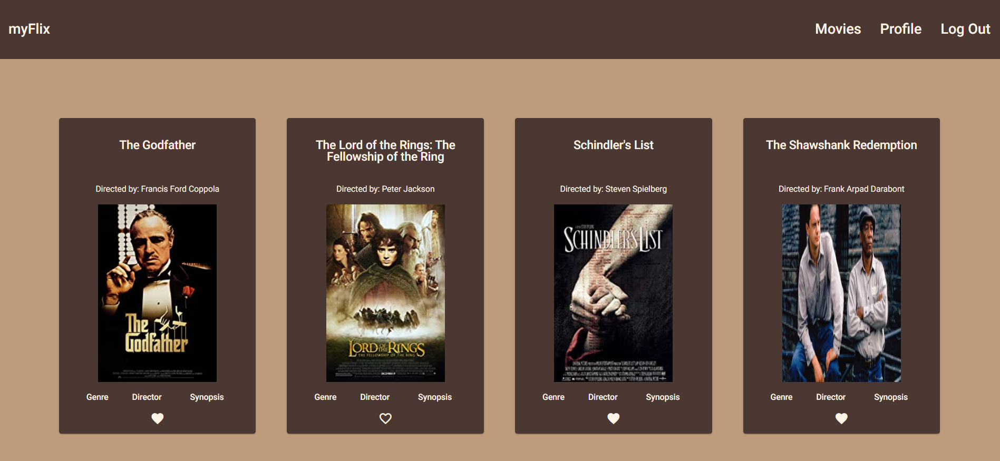

# MyFlixAngularClient

  
  

  
## Description
This is a front-end side that is bult using Angular for a movie application call myFlix. This is based on an existing REST API which is named movie-API.

## Key features
- A welcome page is created as a start page which navigates users to a login or a register dialog.
- After successfully log in, user redirects to the '/movies' endpoint which displays the list of movies.
- Users are able to click in a movie card on the designed buttons and view more details about the movie, genre and director.
- users are also able to add each movie to their favorite movies list.
- users can navigate to the '/profile' endpoint and edit their user information or delete their account. They can also view their list of favorite movies and remove each movie by clicking on a specific button from the list.

## About
This project was generated with [Angular CLI](https://github.com/angular/angular-cli) version 12.2.4.

## Development server

Run `ng serve` for a dev server. Navigate to `http://localhost:4200/`. The app will automatically reload if you change any of the source files.

## Code scaffolding

Run `ng generate component component-name` to generate a new component. You can also use `ng generate directive|pipe|service|class|guard|interface|enum|module`.

## Build

Run `ng build` to build the project. The build artifacts will be stored in the `dist/` directory.

## Running unit tests

Run `ng test` to execute the unit tests via [Karma](https://karma-runner.github.io).

## Running end-to-end tests

Run `ng e2e` to execute the end-to-end tests via a platform of your choice. To use this command, you need to first add a package that implements end-to-end testing capabilities.

## Further help

To get more help on the Angular CLI use `ng help` or go check out the [Angular CLI Overview and Command Reference](https://angular.io/cli) page.
